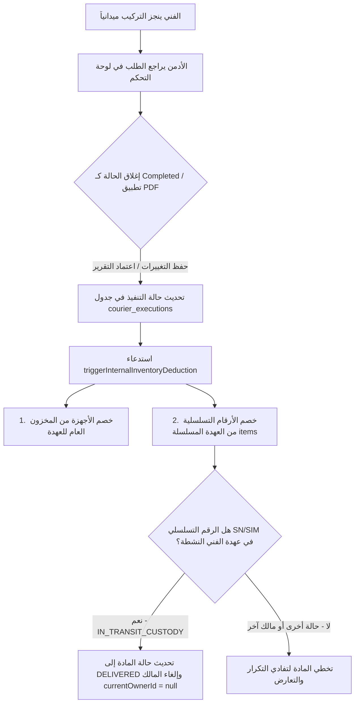

# أتمتة خصم عهدة المندوبين (Courier Inventory Deduction Automation)

يقوم هذا المستند بتوثيق كيفية أتمتة خصم الأجهزة والشرائح من عهدة الفني عند قيام الإدارة (Admin) بإغلاق طلب التوصيل أو اعتماد تقرير الـ PDF كحالة مكتملة.

---

## 📡 تدفق العمل المؤتمت (Automated Workflow)

---

## 🛠️ تفاصيل التطبيق البرمجي (Backend Implementation)

تم تعديل منطق خصم العهدة في كود الخادم (`apps/api/src/modules/courier/application/courier.service.ts`):

1. **جلب بيانات المندوب:** يتم البحث عن الفني المسؤول باستخدام حقل `technicianCode` لمطابقته مع المالك الحالي للمواد في جدول `items`.
2. **تجميع الأرقام التسلسلية:** يتم تجميع كافة الأرقام التسلسلية المدخلة في الطلب:
   - الرقم التسلسلي للجهاز (`execution.sn`)
   - الرقم التسلسلي للشريحة (`execution.simSerial`)
   - الحقول الإضافية إن وُجدت (`extraField1`, `extraField2`)
3. **خصم العهدة المسلسلة:** بالنسبة لكل رقم تسلسلي، يتم التحقق مما إذا كان موجوداً بعهدته النشطة (`IN_TRANSIT_CUSTODY`). وإذا وُجد، يتم إجراء عملية `scanOut` تلقائياً عبر `serializedItemsService.scanOut` لتحديث حالته إلى `DELIVERED` وتوثيق العملية في سجل حركات المستندات (`inventoryTransactions`).

---

## 📷 دعم صور واتساب واستخراج البيانات (WhatsApp Images & OCR Support)

يسمح النظام الآن للأدمن برفع صور التنفيذ مباشرة (مثل الصور التي يرسلها الفني عبر واتساب):
1. **صورة استمارة التوصيل الورقية** (التي تحتوي على معلومات العميل والتواقيع وأرقام الأجهزة).
2. **صورة شاشة عملية الدفع** (التجربة بقيمة 0.01 ريال للتأكد من تفعيل مدى).
3. **صورة خلفية الجهاز والشرائح** (التي تعرض باركود الرقم التسلسلي SN والـ ICCID للشريحة).

**كيفية المعالجة:**
- يقوم النظام تلقائياً بالتعرف على نوع الملف المرفوع.
- في حال كان الملف صورة (`PNG`, `JPG`, `JPEG`, `WEBP`)، يتم إرسال الملف مباشرة إلى محرك الرؤية الذكي (`Anthropic AI Vision` أو `Tesseract OCR`) دون الحاجة إلى ملف PDF.
- يتم عرض الصورة مباشرة في لوحة التحكم بدلاً من الـ `iframe` لتسهيل المراجعة البصرية والمطابقة اليدوية.

---

## 🖥️ تعديل واجهة المستخدم (Admin Portal Frontend)

تم تعديل الصفحات التالية في لوحة التحكم لضمان وضوح وسلاسة التجربة البرمجية:

1. **صفحة تفاصيل الطلب (`courier-request-detail.tsx`):**
   - تحديث التنبيه التعريفي التلقائي ليوضح للأدمن عملية الخصم:
     > **خصم تلقائي من المخزون والعهدة المسلسلة:** عند الحفظ بحالة "مكتمل"، سيتم خصم الأجهزة المُدخلة تلقائياً من عهدة الفني في منظومة المخزون العام وخصم الأرقام التسلسلية (SN/SIM) من عهدته المسلسلة النشطة (Scan-Out).
   - تعيين الفني بشكل تلقائي للقراءة فقط (Read-only) بناءً على الفني المسؤول عن الطلب الأصلي (`request.tecName`)، لمنع الأخطاء البشرية ولضمان دقة توجيه عمليات خصم العهدة للفني الفعلي المكلف بالطلب.
2. **صفحة قائمة الطلبات (`courier-requests.tsx`):**
   - تحديث شريط البحث ليوضح إمكانية البحث الفوري للأدمن بالأرقام التسلسلية لتسهيل مطابقتها:
     > `البحث بـ TID، اسم العميل، رقم الحادثة أو السيريال (SN/SIM)...`
3. **صفحة رفع المستندات (`courier-pdf-upload.tsx` & `courier-pdf-review.tsx`):**
   - السماح للأدمن بسحب وإفلات الصور والملفات الممسوحة (PDF/Images).
   - عرض الصور بشكل متناسق ومريح للعين داخل شاشة المراجعة بجانب الحقول المستخرجة.

---

## 🔍 كيفية التحقق والمراقبة (Verification & Audit)

عند اكتمال الحالة، يمكنك تتبع العمليات من خلال:

1. **سجل تتبع المادة المسلسلة (Item History Logs):**
   - ستلاحظ تغير حالة الرقم التسلسلي من `IN_TRANSIT_CUSTODY` إلى `DELIVERED` عن طريق نظام الأتمتة.
2. **سجل المعاملات (Inventory Transactions):**
   - سيتم تسجيل معاملة جديدة من نوع `DELIVERY` تحمل اسم العميل المستلم ورقم الطلب.
