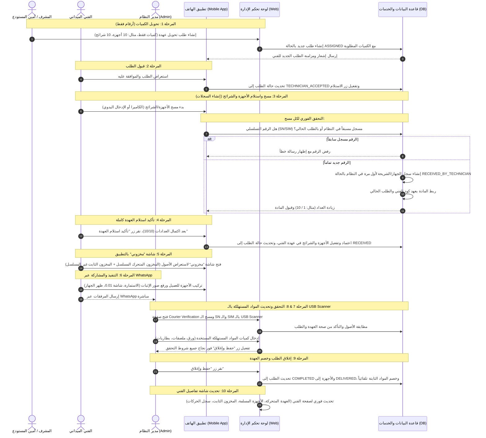

# تقرير شامل: دورة حياة العهدة والأجهزة (StockPro Courier V14)
## الدليل التشغيلي والتقني لتتبع الأجهزة والشرائح من المستودع إلى التسليم والخصم الآلي للمواد المستهلكة

يوضح هذا التقرير التوثيق النهائي والمفصل لدورة حياة العهدة في نظام **StockPro (الإصدار V14)**. يتميز هذا التصميم الفريد بأن **المستودع يتعامل مع الكميات فقط (الأرقام)**، بينما يتم **إنشاء الأرقام التسلسلية وتسجيلها لأول مرة في النظام عند قيام الفني بمسحها واستلامها ميدانياً**، مما يضمن أقصى درجات الدقة والتبسيط التشغيلي. كما يدعم النظام خصم المواد المستهلكة غير المسلسلة تلقائياً عند إغلاق الطلب من لوحة تحكم الإدارة.

---

## 📡 مخطط سير العمل الموحد لـ StockPro Courier V14



---

## 🛠️ الشرح التفصيلي لمراحل العمل (الخطوات العشر لـ V14)

### 1. المرحلة الأولى: إنشاء طلب العهدة من المستودع (Warehouse Transfer Request)
* **المسؤول:** المشرف أو أمين المستودع.
* **آلية العمل:** يقوم المشرف بإنشاء طلب نقل عهدة جديد للفني دون اختيار أرقام تسلسلية محددة. يكتفي بتحديد **الكميات المطلوبة فقط** للطلب.
* **مثال للطلب:**
  * اسم الفني: محمد العتيبي
  * أجهزة POS: 10
  * شرائح SIM: 10
  * رول ورق: 20
  * ملصقات: 10
* **الحالة في قاعدة البيانات:**
  * يتم إنشاء طلب جديد وتكون حالته **`ASSIGNED`**.
  * لا يتم إنشاء أو حجز أي رقم تسلسلي (Serial Number) للأجهزة أو الشرائح في قاعدة البيانات في هذه المرحلة، ولا تنتقل ملكية أي مواد للفني.

### 2. المرحلة الثانية: وصول الطلب للفني وقبوله (Technician Delivery & Acceptance)
* **الإجراء:** يتلقى الفني تنبيهاً فورياً في التطبيق المحمول.
* **الشاشة المعروضة:** يرى الفني الطلب الجديد ببيانات الكميات الإجمالية فقط (10 أجهزة، 10 شرائح، 20 رول، 10 ملصقات) للطلب رقم `CR-00152`.
* **الخيارات المتاحة:**
  * **رفض (Reject):** يعود الطلب للمستودع لإعادة تعديل الكميات.
  * **قبول (Accept):** عند الضغط على قبول، تتحول حالة الطلب في قاعدة البيانات إلى **`TECHNICIAN_ACCEPTED`** ويظهر زر **"بدء استلام العهدة"**.

### 3. المرحلة الثالثة: استلام العهدة ومسح الأصول (Scan-In & Record Creation)
> [!IMPORTANT]
> **هذه المرحلة هي نقطة الحقيقة (Source of Truth) ومرحلة التأسيس الفعلي للبيانات المسلسلة في النظام.**

يفتح الفني شاشة الاستلام بالتطبيق، والتي تعرض عدادات الأصول المسلسلة والكميات الثابتة:
* الأجهزة: `0 / 10`
* الشرائح: `0 / 10`
* الرول: `20` (مؤشر تم الاستلام)
* الملصقات: `10` (مؤشر تم الاستلام)

#### أ. استلام الأجهزة (POS Scanning):
عند مسح الفني للباركود الخاص بالجهاز (مثال: `NCD100233990`)، يقوم النظام بالتحقق الآلي من الشروط التالية:
1. **هل الرقم التسلسلي مسجل مسبقاً في النظام ككل؟**
   * إذا كان موجوداً: يرفض النظام الإدخال ويعرض تنبيهاً: `"هذا الجهاز مسجل مسبقاً في النظام"`.
2. **هل الرقم التسلسلي تم مسحه في نفس الجلسة/الطلب الحالي؟**
   * إذا نعم: يظهر تنبيه: `"تم مسحه سابقاً في هذا الطلب"`.
3. **إذا لم يكن الرقم التسلسلي مسجلاً سابقاً (رقم جديد تماماً):**
   * يقوم النظام **بإنشاء سجل جديد للجهاز** في قاعدة البيانات بالخصائص التالية:
     * الرقم التسلسلي (Serial): `NCD100233990`
     * نوع المادة (Type): `POS`
     * المالك الحالي (Owner): كود الفني (محمد العتيبي)
     * حالة الجهاز (Status): `RECEIVED_BY_TECHNICIAN`
     * الطلب المرتبط (Request): `CR-00152`
   * يتم زيادة عداد الأجهزة في التطبيق بمقدار `1` ليصبح `1 / 10`.

#### ب. استلام الشرائح (SIM Scanning):
* يقوم الفني بمسح الرقم التسلسلي للشريحة (ICCID).
* يتحقق النظام من عدم تسجيلها مسبقاً، ثم ينشئ لها سجلاً جديداً في قاعدة البيانات ويربط ملكيتها للفني في الطلب الحالي.

#### ج. استلام الورق والملصقات (Accessories Confirmation):
* لا تتطلب مسحاً تسلسلياً؛ يظهر فقط مؤشر ☑ تم الاستلام بعد تأكيد الكمية يدوياً.

### 4. المرحلة الرابعة: تأكيد استلام العهدة (Custody Receipt Confirmation)
* عند اكتمال مسح جميع الأجهزة والشرائح المطلوبة ووصول العدادات إلى النهاية (`10/10` للأجهزة و `10/10` للشرائح)، يظهر زر **"تأكيد استلام العهدة"**.
* **الأثر الفني:** عند نقر الفني على هذا الزر، يقوم النظام بإجراء معاملة موحدة (Single Database Transaction) تؤكد تفعيل كافة الأجهزة والشرائح المسحوبة في عهدة الفني، وتسجيل حركة الاستلام التاريخية في النظام، وتحديث حالة الطلب العام إلى **`RECEIVED`** وتدخل رسمياً في رصيد الفني.

### 5. المرحلة الخامسة: صفحة مخزون الفني (My Custody - "مخزوني")
بعد إتمام الاستلام، تظهر للفني شاشة جديدة بالتطبيق باسم **"مخزوني"**، وهي مقسمة إلى قسمين رئيسيين:

#### أ. المخزون المتحرك (Moving Inventory)
* يعرض قائمة الأصول المسلسلة الموجودة تحت تصرفه حالياً (أجهزة POS، شرائح SIM).
* البيانات المعروضة: الرقم التسلسلي (SN)، نوع المادة، الحالة (`بعهدتي`)، وتاريخ الاستلام.
* يدعم البحث السريع بواسطة الرقم التسلسلي.

#### ب. المخزون الثابت (Fixed Inventory)
* يعرض الكميات الإجمالية للمواد غير المسلسلة المتواجدة لديه بالسيارة:
  * رول ورق: `20`
  * ملصقات: `10`
  * بطاريات: `5`

### 6. المرحلة السادسة: تنفيذ المهمة ميدانياً (Field Execution)
* يركب الفني الجهاز للعميل ويملأ الاستمارة الورقية متضمنة البيانات (اسم العميل، رقم الـ TID، التاجر، التاريخ، وتوقيع العميل).
* يلتقط الفني الصور التالية للتوثيق:
  * صورة الجهاز بعد التركيب.
  * صورة الشريحة بوضوح.
  * صورة استمارة التركيب الموقعة.
  * صورة شاشة عملية الدفع التجريبية (0.01 ريال).
* يرسل الفني هذه المرفقات الأربعة مباشرة عبر **WhatsApp** للإدارة/الأدمن، وينتهي دور الفني عند هذا الحد دون القيام بإغلاق الطلب في التطبيق.

### 7. المرحلة السابعة: شاشة التحقق بالإدارة (Admin Verification by Barcode Scanner)
* يفتح الأدمن صفحة التحقق **(Courier Verification)** في لوحة التحكم، ويفتح صور الباركود المرسلة بالواتساب.
* بدلاً من كتابة الأرقام يدوياً لمنع الأخطاء الإملائية، يستخدم الأدمن **قارئ الباركود USB (USB Barcode Scanner)** لمسح الباركود مباشرة من الصور المعروضة على الشاشة:
  * **المسح الأول (Scan SN):** يمسح الأدمن باركود الرقم التسلسلي للجهاز. يقوم النظام فوراً بالبحث وعرض تفاصيل المادة (نوع الجهاز، الرقم التسلسلي، الفني المسؤول، رقم الطلب المرتبط CR-00152، والحالة بعهدة الفني).
  * **المسح الثاني (Scan SIM):** يمسح الأدمن باركود الشريحة، فتظهر تفاصيلها ومطابقتها.
* يتحقق النظام تلقائياً من صحة البيانات وتواجد الأصول بعهدة الفني ونسبتها للطلب الحالي.

### 8. المرحلة الثامنة: تحديث المواد المستهلكة (Update Consumable Materials)
* في نفس شاشة التحقق، يجد الأدمن قسماً مخصصاً بعنوان **"تحديث المواد المستهلكة"**.
* يقوم الأدمن بإدخال كميات المواد المستهلكة التي استخدمها الفني فعلياً في عملية التركيب لهذا العميل:
  * رول ورق: `[ 2 ]`
  * ملصقات: `[ 1 ]`
  * بطاريات: `[ 0 ]`
* سيقوم النظام بخصم هذه القيم المدخلة مباشرة من رصيد "المخزون الثابت" الخاص بالفني فور إغلاق الطلب، دون الحاجة لمسح أرقام تسلسلية لها.

### 9. المرحلة التاسعة: إغلاق الطلب وخصم العهدة الآلي (Request Closing & Auto-Deduction)
بمجرد نقر الأدمن على زر **"حفظ وإغلاق"**، يقوم النظام بتنفيذ العمليات التالية تلقائياً في معاملة واحدة آمنة (Single Database Transaction):
* تحديث حالة الطلب إلى **`COMPLETED`**.
* تحديث حالة الجهاز والشريحة إلى **`DELIVERED`** (تم التسليم للعميل).
* إزالة الأصول المسلمة من العهدة النشطة للفني (`currentOwnerId = NULL`).
* خصم الكميات المحددة للمواد المستهلكة (رول ورق، ملصقات، بطاريات) من المخزون الثابت للفني.
* تسجيل حركة الصرف المخزنية التاريخية وتوثيق الحدث في سجل التدقيق **(Audit Log)**.
* إرسال أحداث النظام عبر **Outbox / Event Bus** لتحديث لوحات تحكم الإدارة وتطبيق الهاتف فوراً.

### 10. المرحلة العاشرة: تحديث صفحة تفاصيل الفني بالإدارة (Technician Details Page)
بمجرد الإغلاق، يتم تحديث صفحة الفني في لوحة تحكم الإدارة تلقائياً، لتصبح مقسمة إلى أربع مناطق واضحة:

1. **المخزون المتحرك الحالي (Current Moving Inventory):**
   * يعرض الأجهزة والشرائح الموجودة حالياً مع الفني في سيارته (والتي لم تركب بعد).
2. **الأجهزة والشرائح المسلمة (Delivered Items):**
   * يعرض السجل الكامل للأجهزة والشرائح التي قام الفني بتركيبها للعملاء، مصحوبة بـ (رقم الطلب، اسم العميل، وتاريخ ووقت التركيب الفعلي).
3. **المخزون الثابت (Fixed Inventory):**
   * يعرض الكميات الحالية المتبقية من المواد غير المسلسلة بعهدة الفني (رول الورق، ملصقات، بطاريات، ملحقات) بعد خصم المستهلك منها تلقائياً.
4. **سجل الحركات (Transaction History):**
   * يعرض تسلسلاً زمنياً كاملاً ومفصلاً لجميع الحركات المخزنية للفني (استلام عهدة، تركيب، تسليم للعميل، خصم تلقائي، أو إعادة للمستودع).

---

## 🔄 دورة حياة الجهاز والشرائح (Item State Machine)

```
المستودع (كميات فقط) ──> ASSIGNED ──> TECHNICIAN_ACCEPTED ──> RECEIVING (مسح الفني) ──> RECEIVED_BY_TECHNICIAN ──> بعهدتي (مخزوني) ──> INSTALLING ──> ADMIN_VERIFICATION ──> DELIVERED
```

---

## 🌟 الميزات التشغيلية والتقنية لتصميم الإصدار V14

* **التحكم بالكميات في المستودع:** يقلل الجهد الإداري المترتب على اختيار ومطابقة آلاف الأرقام التسلسلية داخل المستودع، ويحصرها في الميدان.
* **مسؤولية الفني الكاملة:** يصبح الفني مسؤولاً أمام النظام عن الأرقام التسلسلية التي مسحها بنفسه وتأكد من استلامها في سيارته.
* **سرعة التحقق للإدارة:** استخدام قارئ الباركود USB (Barcode Scanner) يمنع الأخطاء الإملائية واليدوية في مطابقة الأرقام، ويجعل إغلاق الطلب يتم في ثوانٍ معدودة.
* **إدارة المواد غير المسلسلة:** تكامل أتمتة خصم المواد المستهلكة (الورق والملصقات) يدوياً من الأدمن يحافظ على دقة أرقام المخزون الثابت للفني دون إرهاقه بمسحها.
* **صفحة الفني الشاملة:** تقسيم لوحة الفني لأربعة أقسام يمنح الإدارة رقابة كاملة بنسبة 100% على كافة أنواع الأصول (متحركة وثابتة ومسلمة وتاريخية) في شاشة واحدة.
