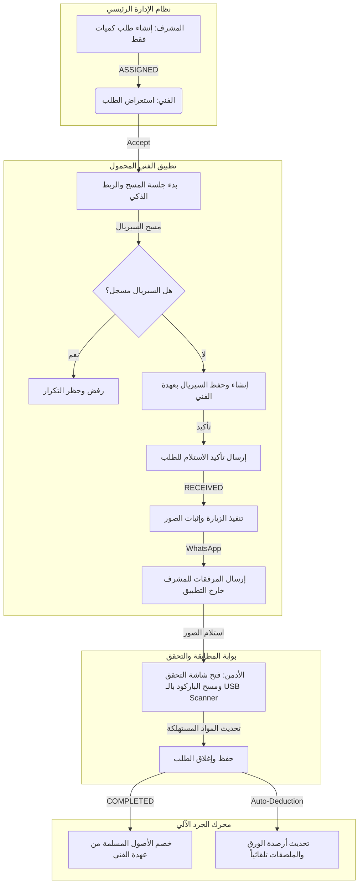

# StockPro Courier V15
## Field Technician Mobile Application Redesign

---

## 1. الهدف الاستراتيجي (Strategic Goal)

> **تطبيق الفني ليس نظاماً لإدارة المخزون.**
> 
> **تطبيق الفني هو أداة تنفيذ ميداني فقط.**
> 
> **جميع العمليات الإدارية والمحاسبية وتحديثات الجرد الفعلي والخصم النهائي تتم داخل النظام الرئيسي (Admin Web Portal).**

الهدف الأساسي من إعادة تصميم التطبيق هو تبسيط حياة الفني الميداني، وجعل التطبيق أداة سلسة ومستقرة لتأكيد الاستلام، تنفيذ التركيبات، والتبليغ عن المرتجعات، مع الحفاظ على أعلى درجات الدقة في مزامنة البيانات دون تداخل مع محرك المخزون الرئيسي للشركة.

---

## 2. حدود مسؤوليات التطبيق (Application Scope)

تحديد نطاق العمل بوضوح يمنع تعقيد الواجهات ويحفظ استقرار النظام:

### ✔ ما يفعله التطبيق (In-Scope):
* **استقبال وإدارة الطلبات:** استعراض طلبات التحويل وتوصيل الأجهزة المنسوبة للفني.
* **القبول أو الرفض:** إمكانية قبول الطلب لبدء العمل أو رفضه مع تدوين السبب لإعادته للمستودع.
* **استلام العهدة وتأكيد المطابقة:** مسح الأجهزة (POS) والشرائح (SIM) ميدانياً وربط أرقامها التسلسلية بعهدة الفني.
* **تنفيذ الزيارات الميدانية:** توجيه الفني خلال مراحل الزيارة (في الطريق، تم الوصول، جاري التركيب).
* **إثباتات الميدان:** التقاط صور التركيب الأربع وتخزين إحداثيات الموقع (GPS) وتوقيع العميل.
* **التكامل مع WhatsApp:** إنشاء وتمرير رسالة موحدة وموثقة بضغطة زر واحدة لمشرف التحقق.
* **عرض المخزون الحالي (العهدة):** إظهار قائمة الأصول المسلسلة بعهدته والكميات المتواجدة لديه من المواد غير المسلسلة.
* **إدارة المرتجعات:** مسح وتوثيق الأجهزة والشرائح المرتجعة من العملاء وإثباتها بالصور والأسباب قبل إدراجها بعهدة الفني كمرتجع.

### ❌ ما لا يفعله التطبيق (Out-of-Scope):
* **إنشاء طلبات تحويل:** لا يستطيع الفني طلب بضاعة جديدة أو إنشاء تحويلات مخزنية بنفسه.
* **إدارة وتعديل المخازن:** لا يملك الفني صلاحية ترحيل أو تعديل كميات المستودعات.
* **إغلاق الطلب نهائياً:** عملية الإغلاق والاعتماد النهائي تتم حصراً من قبل الأدمن عبر لوحة التحكم.
* **خصم المخزون الذاتي:** لا يقوم التطبيق بخصم الأجهزة أو الشرائح أو الورق من الفني; بل يكتفي برفع تقارير الميدان، ويقوم محرك الخصم الآلي (Inventory Engine) في الخلفية بالخصم بناءً على إغلاق الطلب من الأدمن.
* **تعديل مخزون المواد غير المسلسلة (الورق والملصقات):** لا يتحكم الفني بها في التطبيق، بل يتم خصم استهلاكها وتحديثها من خلال شاشة التحقق بالإدارة.

---

## 3. بنية التدفق وتكامل المسؤوليات (Redesign Architecture)

يتدفق العمل في نظام **StockPro Courier V15** بتسلسل واضح يوزع المسؤوليات كالتالي:



---

## 4. شاشات التطبيق الثمانية (The Eight Core Screens)

سيعاد تصميم واجهة التطبيق بالكامل بالاعتماد على 8 شاشات رئيسية ومتكاملة:

### 1️⃣ لوحة التحكم الرئيسية (Dashboard)
* **الوظيفة:** نقطة البداية للفني. تعرض ملخص العمل اليومي والوصول السريع لعهدة الفني.
* **المكونات:** بطاقة الفني العليا، العدادات الدائرية (نسبة إنجاز اليوم)، قائمة التنبيهات والأجهزة المرتجعة، وأزرار الاختصار السريع لشاشة مخزوني وشاشة الطلبات.

### 2️⃣ قائمة طلبات التوصيل (Courier Requests)
* **الوظيفة:** عرض الطلبات المنسوبة للفني ومصنفة حسب حالتها.
* **المكونات:** تبويبات لتصفية الحالات (بانتظار القبول، مستلمة وقيد التنفيذ، منتهية)، شريط بحث ذكي للبحث برقم العميل أو رقم الطلب.

### 3️⃣ تفاصيل الاستلام والفحص الكمي (Receiving Details)
* **الوظيفة:** عرض مواصفات طلب التحويل الوارد من المستودع بالكميات المطلوبة فقط.
* **المكونات:** قائمة بالكميات الإجمالية (مثال: POS: 10, SIM: 10) مع مؤشرات التقدم للقطع الممسوحة وزر "بدء استلام العهدة".

### 4️⃣ محرك المسح الذكي للعهدة (Smart Scanner Screen)
* **الوظيفة:** مسح الباركود الخاص بالأجهزة والشرائح وتعيينها لعهدة الفني.
* **المكونات:** قارئ الكاميرا المدمج مع فلاش ومؤشر ضوئي عائم، حقل الإدخال اليدوي للأرقام، وجدول سفلي يعرض السيريلات المقبولة لحظة بمسحها.

### 5️⃣ مراجعة جلسة الاستلام (Receiving Review)
* **الوظيفة:** مراجعة كافة المواد الممسوحة وتحديد أي مواد فيها عيب أو نقص قبل الاعتماد النهائي.
* **المكونات:** قائمة المواد المقبولة مع تفاصيلها، قسم خاص بالمواد التي بها عيوب أو مشاكل مع مبرراتها، وزر الترحيل النهائي للخادم.

### 6️⃣ تنفيذ الزيارة الميدانية (Visit Execution)
* **الوظيفة:** إدارة حالة الزيارة الحالية والتقاط الإثباتات الفنية.
* **المكونات:** شريط التحكم بحالة الزيارة (على الطريق، تم الوصول، قيد التركيب)، معرض التقاط صور الإثبات الأربع، حقول إدخال السيريال المستبدل أو المركب، وحاوية إنشاء وإرسال رسالة الواتساب الجاهزة.

### 7️⃣ إدارة المرتجعات (Returned Devices Screen)
* **الوظيفة:** توثيق وسحب الأجهزة أو الشرائح المستبدلة من موقع العميل وإضافتها لعهدة الفني كأصل مرتجع.
* **المكونات:** ماسح باركود للجهاز المرتجع، قائمة منسدلة لتحديد سبب الارتجاع (تالف، استبدال موديل، إلغاء خدمة)، حقل التقاط صورة لحالة الجهاز المرتجع، وزر إدراج المرتجع في المخزن المحلي.

### 8️⃣ شاشة مخزوني (My Inventory)
* **الوظيفة:** عرض العهدة الكلية الحالية للفني بالتفصيل.
* **المكونات:** 
  * **المخزون المتحرك (Moving Inventory):** قائمة الأصول المسلسلة (POS و SIM) النشطة بعهدته وحالتها (`RECEIVED_BY_TECHNICIAN`).
  * **المخزون الثابت (Fixed Inventory):** عدادات الكميات للمواد غير المسلسلة (بكرات ورق POS، ملصقات الدعاية، البطاريات).

---

## 5. محرك استلام العهدة الميداني (Receiving Engine)

يحتوي محرك الاستلام الذكي على الميزات التقنية التالية لضمان الدقة العالية:
* **جلسات التخزين المحلي (Hive Session Caching):** يتم تخزين أي جلسة مسح نشطة تلقائياً في قاعدة بيانات Hive المحلية باستخدام رقم الطلب كمفتاح فريد لمنع ضياع البيانات عند إغلاق التطبيق.
* **الربط التلقائي الحر (Order-free Matching):** بما أن الطلب قادم من المستودع بكميات فقط، فإن المحرك يقوم تلقائياً بربط أي باركود ممسوح بأقرب خانة فارغة مطابقة للنوع (POS أو SIM) دون إلزام الفني بترتيب معين.
* **كشف التكرار المزدوج (Duplicate Detection):** يمنع المحرك قبول أي سيريال تم مسحه مسبقاً في نفس الجلسة أو مسجل كأصل مفعل لدى فني آخر في النظام.
* **مؤشرات تقدم حية (Progress Indicators):** تحديث فوري لنسبة تقدم المسح (مثال: 7/10 أجهزة ممسوحة) لتوجيه الفني بصرياً.

---

## 6. تنفيذ الزيارة ومشاركة الإثبات (Visit Execution)

لتسهيل عمل الفني، تم تبسيط خطوات إغلاق المهام ميدانياً:
* **التسجيل الجغرافي الصامت (Auto-GPS Capture):** يلتقط التطبيق إحداثيات خطوط الطول والعرض للزيارة تلقائياً وتوثيقها في قاعدة البيانات فور الضغط على زر بدء التركيب.
* **معرض الإثباتات الأربع (4-Photo Verification):** إلزامية التقاط (1. ظهر الجهاز، 2. الشاشة موضحة رقم TID، 3. استمارة التركيب الموقعة، 4. صورة الشريحة بوضوح).
* **معالج مشاركة الواتساب (WhatsApp Share Builder):** بعد حفظ الصور، يقوم التطبيق بتجهيز نص رسالة منسق يحتوي على (اسم العميل، رقم الهاتف، أرقام السيريال المستخدمة، وحالة التركيب) ويفتح تطبيق الواتساب مباشرة لإرسالها مع الصور بضغطة واحدة إلى الأدمن للتحقق منها خارج النظام.
* **الاستبعاد التام لزر الإغلاق:** لا تحتوي هذه الشاشة على زر "إغلاق الطلب" أو "تعديل المخزون الثابت"، لأن الخصم والمطابقة هي مسؤولية الأدمن والـ Verification Screen بالنظام الرئيسي.

---

## 7. إدارة سحب المرتجعات (Returned Devices Module)

إجراء سحب المرتجعات يُعد ركيزة أساسية لضمان سلامة العهدة التاريخية للفني:
1. **المسح والترميز للارتجاع:** يقوم الفني بفتح شاشة المرتجعات ومسح سيريال الجهاز المسترد من العميل.
2. **التقاط صورة الحالة:** التقاط صورة فوتوغرافية للجهاز المسترد توضح حالته المادية.
3. **تحديد سبب الارتجاع:** اختيار السبب من قائمة محددة سلفاً (مثال: عطل شاشة، عطل شبكة، إلغاء عقد).
4. **المزامنة والربط بالعهدة:** فور إرسال المرتجع، يتم إدراج السيريال تحت تصنيف `RETURNED_TO_TECHNICIAN` وتدخل بعهدة الفني كأصل مرتجع يجب تسليمه لاحقاً للمستودع، مما يضمن ألا تضيع الأجهزة المستبدلة دون تتبع في الميدان.

---

## 8. شاشة مخزون الفني (My Inventory Dashboard)

صممت هذه الشاشة لتمنح الفني نظرة واضحة ودقيقة عن عهدته لتجنب أي فروقات مالية:

### أ. المخزون المتحرك المسلسل (Moving Serialized Inventory)
* يعرض كافة الأجهزة والشرائح المرتبطة بكود الفني والتي تم استلامها بنجاح.
* يدعم الفلترة حسب نوع الجهاز والبحث بالرقم التسلسلي.
* يعرض بوضوح حالة كل قطعة (مثال: `RECEIVED_BY_TECHNICIAN` / `RETURNED_TO_TECHNICIAN`).

### ب. المخزون الثابت غير المسلسل (Fixed Non-Serialized Inventory)
* يعرض كمية المواد الاستهلاكية (بكرات ورق POS، ملصقات دعاية، البطاريات).
* الأرقام المعروضة هنا هي للقراءة فقط (Read-Only) لتمكين الفني من معرفة الرصيد المتبقي معه بالسيارة، وتحديثها يجرى تلقائياً عند قيام الأدمن بإغلاق الطلبات وخصم المواد المستهلكة المستعملة بالزيارة.

---

## 9. معالجة وتدفق العمل دون اتصال (Offline Architecture Flow)

يتم ضمان استمرار العمل وسلاسة المسح بدون إنترنت عبر المعالجة المتتالية التالية:

```
[ماسح الباركود / الكاميرا بالتطبيق]
                 │
                 ▼
[التحقق المحلي والمطابقة بالكميات] ──► (حظر التكرار + الربط بالخانة الفارغة)
                 │
                 ▼
[الكتابة اللحظية في صندوق Hive المحلي] ──► (تأمين الجلسة ومقاومة الإغلاق المفاجئ)
                 │
                 ▼
[محاولة الإرسال الفوري للخادم]
                 │
      ┌──────────┴──────────┐
      ▼ (نجاح الاتصال)       ▼ (فشل الاتصال / لا يوجد شبكة)
[تحديث حالة الطلب]      [نقل الطلب إلى طابور المزامنة المحلي (Sync Queue)]
                             │
                             ▼
                    [فحص دوري لحالة الشبكة (Network Monitor)]
                             │
                             ▼
                    [إعادة محاولة المزامنة التلقائية (Auto-Retry Sync)]
                             │
                             ▼
                    [تفريغ طابور المزامنة وتأكيد الاستلام بالخادم]
```

---

## 10. نظام التصميم والواجهات البصرية (UI Design System)

* **السمة الداكنة الفاخرة (Premium Dark Theme):** خلفية بلون أزرق داكن غامق ومريح للعين يقلل استهلاك البطارية في الميدان.
* **البطاقات الزجاجية (Glassmorphism Cards):** استخدام تدرجات لونية شفافة مع تظليل ناعم وحدود نيون رقيقة للتمييز بين عناصر الطلبات والمخازن.
* **مكتبة الحركات التفاعلية (Lottie Animations):** دمج ملفات أنيميشن ممتازة تعبر عن:
  * *الاستلام الناجح:* رسم متحرك يوضح سلة خضراء ممتلئة.
  * *الفشل أو التكرار:* علامة تعجب متحركة باللون المرجاني.
  * *الانتظار والمزامنة:* تروس متحركة بلون سيان مضيء.
* **حجم تباعد مريح (Responsive Spacing):** تباعدات مريحة وتكبير أزرار الإجراءات الأساسية لتسهيل النقر أثناء القيادة أو التواجد بالميدان.

---

## 11. بنية كود فلاتر المستهدفة (Flutter Clean Architecture)

يتبع بناء الكود مبدأ فصل المسؤوليات وتأمين سهولة الصيانة مستقبلاً:

```
[Presentation Layer] ──► صفحات العرض والواجهات (Widgets & Pages)
         │
         ▼
[Controllers Layer] ──► منطق العمل وإدارة الحالة الحية وتكامل GetX
         │
         ▼
[Repositories Layer] ──► اتخاذ قرار مصدر البيانات (مزامنة فورية أم تخزين محلي)
         │
         ├──────────────────────────┐
         ▼                          ▼
[API Providers Layer]      [Hive Cache Layer]
(واجهات الاتصال بالخادم)      (طابور البيانات المحلي)
```

---

## 12. خريطة طريق التنفيذ (Execution Roadmap)

سيتم تنفيذ خطة التطوير وإعادة الهيكلة خلال 8 مراحل متتالية ومنظمة:

### 🧩 Phase 1: Core Architecture & Setup
* تهيئة هيكلية المجلدات الجديدة وضبط إعدادات ثيم الألوان والخطوط الداكنة وتأمين مكتبة GetX.
* إنشاء وتهيئة صناديق Hive المحلية لمعالجة الجلسات والارتجاع.

### 🧩 Phase 2: UI Design & Design System Implementation
* بناء المكونات الأساسية المشتركة (بطاقات Glassmorphism، الأزرار النيون المتدرجة، ودعم Lottie).
* تصميم وتطبيق شاشة لوحة التحكم الرئيسية (Dashboard).

### 🧩 Phase 3: Receiving Module (Checklist & Reviews)
* تصميم وبرمجة شاشتي `Receiving Details` و `Receiving Review` وتفاعلها مع حالة الطلب.
* ربط ترحيل الجلسات وعرض التقدم الفعلي للاستلام.

### 🧩 Phase 4: Smart Scanner Engine
* بناء وبرمجة شاشة `Smart Scanner Screen` المدمجة.
* دمج منطق الربط التلقائي الحر وكشف تكرار الأرقام التسلسلية.

### 🧩 Phase 5: Visit Execution Module
* تصميم وتطوير واجهة `Visit Execution` والتحكم بمراحل الزيارة.
* دمج ميزة التقاط الـ GPS التلقائي، معرض الصور الأربع، وبناء رسالة الواتساب ومشاركتها.

### 🧩 Phase 6: Returned Devices Module
* تصميم وبرمجة شاشة `Returned Devices Screen` وسحب الأجهزة من الميدان.
* ربط المرتجعات بحالة العهدة المحلية ومزامنتها مع قاعدة البيانات.

### 🧩 Phase 7: Inventory Module (Moving & Fixed)
* تصميم وبرمجة شاشة "مخزوني" بالتطبيق وفصل الأقسام (المسلسلة والكمية).
* ربط التحديثات التلقائية القادمة من الخادم للعهدة بعهد إغلاق الطلب.

### 🧩 Phase 8: Offline Sync Engine & QA Testing
* برمجة طابور المزامنة المتقدم (Sync Queue) وتجربة سيناريوهات انقطاع الإنترنت.
* إجراء الفحوصات الفنية الشاملة لضمان استقرار التطبيق بنسبة 100% وإصدار ملف الـ APK التجريبي.
