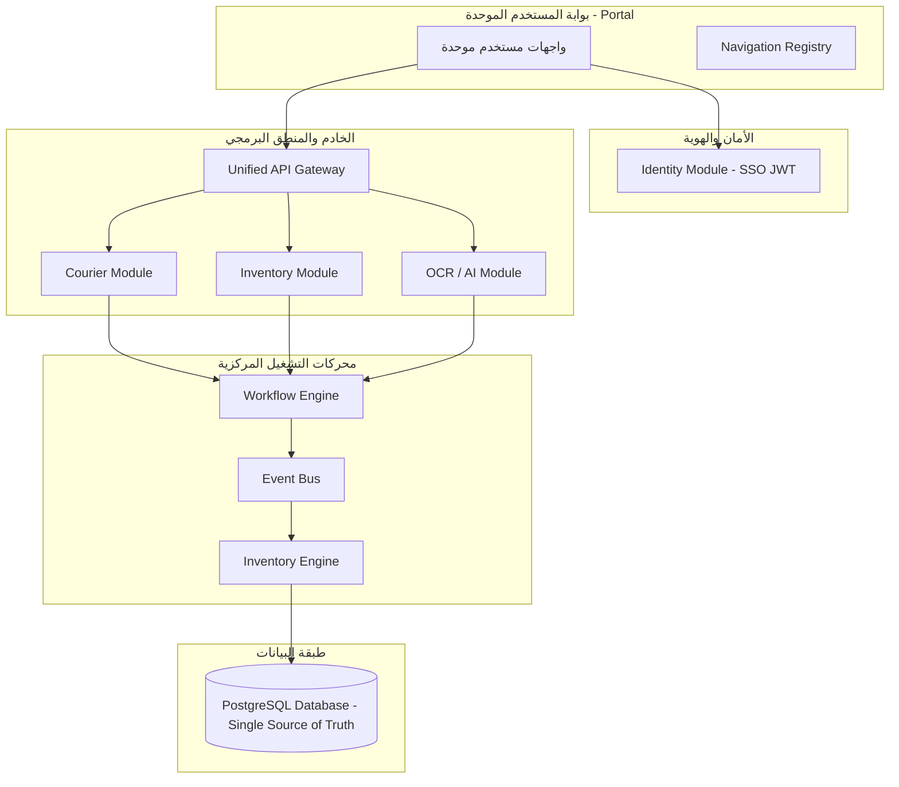

# خارطة طريق الدمج الشامل

# StockPro Operations Platform v12.0
## Unified Operations Platform Roadmap

---

# الهدف الإستراتيجي
تحويل **StockPro** و **RASSCO** من نظامين مستقلين إلى منصة تشغيل مؤسسية موحدة (Unified Operations Platform) تعتمد على:
* قاعدة بيانات واحدة.
* نظام هوية وصلاحيات موحد.
* Backend موحد.
* واجهة مستخدم موحدة.
* Workflow موحد.
* Event-Driven Architecture.
* Inventory Engine مركزي.

بحيث تعمل جميع الوحدات كوحدة واحدة دون أي اعتماد متبادل على أنظمة منفصلة.

---

# المرحلة الأولى: توحيد طبقة البيانات (Data Layer Consolidation) - ✅ مكتملة
## الهدف
إنشاء مصدر بيانات موحد (Single Source of Truth).

### التنفيذ
* ترحيل جميع جداول Courier إلى PostgreSQL.
* ترحيل البيانات التاريخية بالكامل.
* إزالة SQLite نهائياً.
* توحيد العلاقات (Foreign Keys).
* مراجعة الفهارس (Indexes).
* توحيد UUID و Sequences.

الجداول المستهدفة:
* `courier_requests`
* `courier_executions`
* `courier_documents`
* `courier_uploads`
* `courier_pdf_reviews`
* `courier_history`
* `courier_logs`
* `courier_notes`
* `courier_status_history`

### المخرجات
* PostgreSQL فقط.
* لا توجد أي قاعدة بيانات ثانوية.

---

# المرحلة الثانية: توحيد الهوية والصلاحيات (Identity & RBAC) - ✅ مكتملة
## الهدف
إلغاء جميع أنظمة تسجيل الدخول المنفصلة.

### التنفيذ
إنشاء Identity Module مركزي مسؤول عن:
* Login / Logout
* JWT / Refresh Tokens
* Roles / Permissions / Sessions

واعتماد جدول `users` واحد فقط يتضمن:
* `employeeCode`
* `technicianCode`
* `department`
* `role`
* `permissions`
* `status`

---

# المرحلة الثالثة: إعادة هيكلة الـ Backend
## الهدف
تحويل جميع الوظائف إلى Modular Monolith.
يصبح الهيكل تحت المسار:
`apps/api/src/modules`
* `identity`
* `inventory`
* `courier`
* `ocr`
* `notifications`
* `workflow`
* `audit`
* `analytics`

ويكون لكل موديول (Module): Controllers, Services, Repositories, DTOs, Validators, Events.

---

# المرحلة الرابعة: Workflow Engine المركزي
بدلاً من توزيع منطق الأعمال داخل الصفحات أو الخدمات، يتم إنشاء محرك Workflow مركزي مسؤول عن إدارة دورة حياة الطلب:
```text
Verification ──> Execution ──> Validation ──> Workflow ──> Inventory ──> Notification ──> Audit ──> Close
```
جميع الحالات تمر بنفس الدورة المتكاملة.

---

# المرحلة الخامسة: Event-Driven Architecture
## الهدف
فصل الموديولات عن بعضها تقنياً.
```text
Courier ──> Event Bus ──> Inventory & Notification & Analytics & Audit Subscribers
```

### الأحداث الرئيسية:
* `DeviceInstalledEvent`
* `ExecutionCompletedEvent`
* `InventoryDeductedEvent`
* `RequestClosedEvent`
* `RequestReturnedEvent`
* `OCRCompletedEvent`
* `PDFReviewedEvent`

---

# المرحلة السادسة: Inventory Engine
إنشاء محرك مخزون مركزي مسؤول عن:
* Warehouse / Custody
* Serialized Items
* Transactions / Item History

ولا يسمح لأي موديول آخر بالتعديل المباشر في جداول المخزون، حيث تتم كافة العمليات من خلال الـ Inventory Engine فقط.

---

# المرحلة السابعة: Preventive Validation Engine
قبل اعتماد أي طلب مكتمل يقوم النظام بالتحقق من:
* وجود الجهاز والشريحة.
* أن الجهاز والشريحة بعهدة الفني المسؤول حالياً.
* أن الحالة الحالية للمواد هي `IN_TRANSIT_CUSTODY`.
* في حالة الفشل، يتم رفض المعاملة (`Reject Workflow`) مع إنشاء سجل تدقيق (Audit Log).

---

# المرحلة الثامنة: Automation Engine
عند اعتماد حالة مكتمل (Completed)، يتم تنفيذ التسلسل التالي تلقائياً:
```text
Execution Saved ──> Workflow Engine ──> Inventory Engine ──> Scan-Out ──> DELIVERED ──> Inventory Transaction ──> Audit Log ──> Request Closed
```

أما الحالات الأخرى:
* **Not Completed:** حفظ البيانات والسبب ──> إغلاق الطلب (بدون خصم).
* **Customer Not Answering:** حفظ البيانات ──> إغلاق الطلب (بدون خصم).
* **In Progress:** حفظ البيانات ──> إبقاء الطلب مفتوحاً.

---

# المرحلة التاسعة: OCR & AI Platform
يدعم النظام معالجة (PDF, JPG, PNG, WEBP) وفق الخطوات التالية:
```text
Upload ──> OCR ──> AI Extraction ──> SN/SIM Validation ──> Auto Fill ──> Admin Review
```

---

# المرحلة العاشرة: واجهة التحقق الموحدة
اعتماد الـ Wizard ثنائي المراحل لجميع الطلبات:
```text
شاشة التحقق ──> إدخال البيانات ──> المرحلة 1 (Verification) ──> التالي ──> المرحلة 2 (Execution) ──> حفظ وإكمال
```
وجميع الحالات تمر بنفس المسار ويختلف القرار المنفذ بواسطة الـ Workflow Engine بعد الحفظ.

---

# المرحلة الحادية عشرة: Navigation Registry
إلغاء أي Navigation مستقل وربط كافة الصفحات بالـ Navigation Registry الموحد المدار كلياً بنظام الصلاحيات (RBAC):
* Dashboard / Inventory / Warehouses / Transfers
* Courier Verification / Completed Orders
* OCR Review / Administration / Settings

---

# المرحلة الثانية عشرة: واجهة المستخدم الموحدة
توحيد الهوية المرئية لجميع الموديولات (Theme, Colors, Typography, Components, Sidebar, Layout, Forms, Dialogs, Tables) لتظهر كمنصة متكاملة متجانسة.

---

# المرحلة الثالثة عشرة: Audit & Monitoring
إضافة نظام مراقبة مركزي يسجل كافة العمليات الهامة:
* تسجيل الدخول والخروج.
* تعديل واعتماد وإرجاع الطلبات.
* خصم العهدة وإلغاؤه.
* تغييرات المخزون وأحداث الـ OCR.

مع توفير إمكانية البحث والتصفية وتتبع سجلات التدقيق بالكامل.

---

# المرحلة الرابعة عشرة: Notifications Center
توحيد مركز الإشعارات والتنبيهات الموجهة للمشرفين والمدراء:
* تم اعتماد الطلب أو إرجاعه للمشرف.
* فشل التحقق من العهدة.
* تم خصم الجهاز أو وجود اختلاف في الأرقام التسلسلية.
* اكتمال عمليات الـ OCR أو وجود طلب يحتاج مراجعة فورية.

---

# المرحلة الخامسة عشرة: التحول الكامل إلى منصة موحدة
بعد اكتمال المراحل السابقة، يتم التخلص نهائياً من أي إشارة لـ RASSCO، وتتحول البنية بالكامل لتصبح:
```text
StockPro Portal ──> Identity (SSO) ──> API Gateway ──> Workflow Engine ──> Modules (Inventory, Courier, OCR, etc.) ──> Event Bus ──> Inventory Engine ──> PostgreSQL (Single Source of Truth)
```

---

# المرحلة السادسة عشرة: هندسة الاعتمادية والمراقبة (Reliability & Observability Hardening)
لترقية البنية إلى فئة الأنظمة المؤسسية الضخمة (Enterprise-grade)، تم بناء الركائز الأساسية للاعتمادية والمراقبة:
1. **API Versioning (✅ مكتمل):** إجبار جميع مسارات الـ API على استخدام بادئات واضحة مثل `/api/v1/` عبر وسيط إعادة التوجيه الذكي.
2. **Domain Events Versioning (✅ مكتمل):** وضع بادئات إصدار للأحداث عبر `BaseDomainEvent` ودعم تتبع الارتباط (`correlationId` / `causationId`).
3. **Outbox Pattern (✅ مكتمل):** جدول `outbox_events` لحفظ ونشر الأحداث بشكل موثوق وذري مع إعادة المحاولة التلقائية (Retry Strategy) والتحويل إلى صندوق الرسائل التالفة (DLQ) لضمان عدم ضياع أي حدث.
4. **Idempotency Control (✅ مكتمل):** إنشاء جدول `idempotency_records` واستخدام مفتاح تفرد لمنع تنفيذ المعاملة نفسها أو خصم المخزون بشكل مكرر عبر `IdempotencyService`.
5. **Retry Strategy & DLQ (✅ مكتمل):** نظام إعادة محاولة مجدول مدمج في الـ Outbox Publisher مع نقله لـ DEAD status عند استنفاد 3 محاولات.
6. **Distributed Locks / Row Versioning (✅ مكتمل):** تفعيل Optimistic Locking لحماية السجلات من تضارب الحفظ والخصم المتزامن.

7. **Saga / Compensation (✅ مكتمل):** توفير آليات تعويض وتراجع آلي عند فشل إحدى خطوات سير العمل المتتابع عبر `CourierSagaSubscriber`.
8. **Metrics & Tracing (✅ مكتمل):** رصد مؤشرات الأداء الحيوية لزمن استجابة العمليات والطلب، وعرضها عبر لوحة تحكم التتبع والمقاييس الفائقة.
9. **Health Checks (✅ مكتمل):** إضافة مسارات الجاهزية `/health/live` و `/health/ready` للمراقبة السحابية (K8s/Docker) ومستويات المكونات التابعة.
10. **Feature Flags & Security (✅ مكتمل):** إتاحة تفعيل أو إلغاء المكونات البرمجية ديناميكياً بدون إعادة تشغيل عبر `FeatureFlagService` وقفلها بحماية Security Headers ومعدل الطلبات (Rate Limiting).
11. **Config Service & Logger (✅ مكتمل):** عزل قراءة متغيرات البيئة عبر `ConfigService` وتوجيه السجلات بصيغة JSON مهيكلة بالكامل تتضمن السياق التتبعي.


---

# المرحلة السابعة عشرة: الاستلام ثنائي المراحل وإدارة العناصر الفردية للطلب (Request Items & Progressive Receiving Workflow)

## الهدف
الارتقاء بمنظومة تتبع الأصول إلى الفئة المؤسسية تماثلا مع أنظمة Oracle Field Service و SAP EWM؛ حيث يتم تفكيك كل طلب تركيب إلى عناصر مستقلة (Request Items). هذا الفصل يسمح بتتبع حركة كل جهاز وشريحة بدقة ككيان مستقل طوال دورة حياته، ويدعم عمليات الاستلام الجزئي والتركيب والارتجاع والتدقيق دون حدوث أي تعارض في العهدة.

---

### طبقة البيانات الجديدة: جدول عناصر الطلب (Request Items Schema)

يتم ربط كل جهاز أو شريحة أو ملحق بجدول وسيط يمثل البنود الفردية للطلب:

```sql
courier_request_items
---------------------
id                  SERIAL PK
request_id          INT FK -> courier_requests (Cascade)
item_type           VARCHAR(50) -- 'POS', 'SIM', 'ACCESSORY', 'DOCUMENT'
inventory_item_id   INT FK -> items (NULL for non-serialized assets)
serial_number       VARCHAR(100) NULL -- SN للمحطات
sim_serial          VARCHAR(100) NULL -- ICCID للشريحة
quantity            INT DEFAULT 1
status              VARCHAR(50) DEFAULT 'PENDING_RECEIPT'
scanned_at          TIMESTAMP NULL
received_at         TIMESTAMP NULL
installed_at        TIMESTAMP NULL
delivered_at        TIMESTAMP NULL
technician_id       VARCHAR FK -> users.id NULL
created_at          TIMESTAMP DEFAULT NOW
updated_at          TIMESTAMP DEFAULT NOW
```

---

### تصميم دورة العمل مع تتبع العناصر الفردية

#### 1. المشرف يرسل الطلب (Dispatch & Creation)
* يحدد المشرف المكونات المطلوبة للطلب (الأجهزة، الشرائح، الأوراق، الملحقات).
* عند الضغط على "إرسال للفني":
  * تصبح حالة الطلب الرئيسي: ASSIGNED (بانتظار قبول الفني).
  * يقوم النظام تلقائيا بإنشاء سجلات منفصلة في جدول courier_request_items لكل مادة مسندة بحالة: PENDING_RECEIPT.
  * تظل الأجهزة والشرائح بعهدة المستودع الأصلي ولا تنتقل للفني في هذه المرحلة.

#### 2. الفني يقبل الطلب مبدئيا (Technician Acceptance)
* يستعرض الفني ملخص الطلب وعدد الأصول.
* في حال الرفض: يسجل السبب وتلغى العملية وتظل الأصول بالمستودع.
* في حال القبول: تتحول حالة الطلب إلى ACCEPTED وينتقل تلقائيا لشاشة المسح والتحقق.

#### 3. تأكيد الاستلام بالمسح ومطابقة السجل الفردي (Granular Scan Verification)
* تظهر واجهة الفني قائمة البنود الفردية بشكل جذاب:
  ```text
  استلام الطلب
  ----------------
  [ ] POS - SN001      (بانتظار المسح)
  [ ] POS - SN002      (بانتظار المسح)
  [ ] SIM - SIM001     (بانتظار المسح)
  ----------------
  0 / 3 تم استلامها
  ```
* قواعد التحقق الصارمة أثناء المسح (Scan Rules):
  * التحقق من التكرار: إذا مسح الفني جهازا تم استلامه مسبقا في نفس العملية، يعرض التطبيق رسالة تنبيه: (تم استلام هذا الجهاز مسبقا) دون إجراء تعديلات مكررة.
  * التحقق من المخصص للطلب: إذا مسح سيريال غير مسجل في courier_request_items لهذا الطلب، تظهر رسالة حمراء: (هذا الجهاز غير مخصص لهذا الطلب).
  * التحقق من التعارض مع طلبات أخرى: إذا مسح سيريال مرتبط بطلب نشط آخر، تظهر رسالة خطأ صريحة: (الجهاز مرتبط بطلب آخر Request #1455) لحظر سرقة الأصول بين الطلبات.
  * توليد الترتيب التلقائي: يتم ملء الصفوف تلقائيا بناء على ما يتم مسحه؛ ولا يتحكم الفني بالصف الذي يتم تعبئته.
* الملحقات والأوراق: يتم عرضها في أسفل الشاشة كبطاقات تأكيد بصري (مثل: عقود، ملصقات، رول حراري) ويضغط الفني على زر "تم الاستلام" لتأكيد استلامها بدون مسح باركود.

#### 4. الاستلام التدريجي والجزئي (Progressive & Partial Receiving)
* يدعم النظام الاستلام الجزئي بشكل كامل؛ فمثلا إذا أرسل المستودع 10 أجهزة، واكتشف الفني ميدانيا ضياع أو تلف جهازين:
  * يمسح الفني 8 أجهزة فقط فتتحول حالتها بجدول العناصر إلى RECEIVED.
  * يحدد الجهازين المتبقيين بحالة MISSING أو REJECTED مع كتابة السبب.
  * تتحول حالة الطلب الرئيسي تلقائيا إلى PARTIALLY_RECEIVED (مستلم جزئيا).
  * يتم إشعار المشرف فورا بنسبة الاستلام (8 / 10)؛ ويستطيع المشرف لاحقا استكمال شحن الأصول الناقصة لنفس الطلب دون الحاجة لإلغائه أو إنشاء طلب جديد.

#### 5. النقل الذري للعهدة (Atomic Transaction)
* عند الضغط على "تأكيد الاستلام" (سواء كلي أو جزئي)، يتم تنفيذ ما يلي داخل Transaction قاعدة بيانات واحدة:
  * تحديث حالة العناصر المستلمة بجدول courier_request_items إلى RECEIVED.
  * نقل عهدة الأجهزة الممسوحة بنجاح إلى الفني في الـ Inventory Engine وتغيير حالتها المادية إلى IN_TRANSIT_CUSTODY.
  * إنشاء سجلات التدقيق والحركات التاريخية لكل أصل مستلم.

#### 6. عزل شاشة التنفيذ (Execution Screen Isolation)
* عند فتح الفني لشاشة البدء في التنفيذ والتركيب، يقرأ التطبيق الأصول مباشرة من جدول courier_request_items وليس من جدول عهدة الفني العام.
* الفائدة المعمارية: منع إدراج أي أجهزة إضافية تم إضافتها لعهدة الفني العام بعد تاريخ شحن هذا الطلب، مما يضمن ثبات حصر المواد المخصصة للعملية.

---

### جدول الحالات المحدث للمنصة (Enterprise State Machine)

#### 1. آلة حالات الطلب (Request / Order States)
```text
CREATED               --> تم إنشاء طلب التركيب/الشحن بالخلفية
   ↓
ASSIGNED              --> تم إسناد الطلب واختيار المواد من المشرف
   ↓
ACCEPTED              --> وافق الفني مبدئيا على استلام المهمة
   ↓
RECEIVING             --> الفني يقوم بمسح ومطابقة الأجهزة حاليا
   ↓
RECEIVED              --> تم مطابقة واستلام كافة الأصول بالكامل بنجاح
   ↓ (مسار بديل)
PARTIALLY_RECEIVED    --> تم استلام جزء من الأجهزة مع وجود نقص/تالف
   ↓
ON_ROUTE              --> الفني متوجه حاليا لموقع العميل
   ↓
INSTALLING            --> بدأ الفني في عملية التركيب والتشغيل ميدانيا
   ↓
COMPLETED             --> تم إكمال التركيب وإغلاق الطلب نهائيا
```

#### 2. آلة حالات الأجهزة والأصول (Device / Asset States)
```text
WAREHOUSE              --> الجهاز متواجد في المستودع الرئيسي أو الفرعي
   ↓
PICKED                 --> تم حجز وتعبئة الجهاز للطلب (Pending Dispatch)
   ↓
RECEIVED_BY_TECHNICIAN --> تم فحص ومسح الجهاز من قبل الفني (Verified)
   ↓
IN_TRANSIT_CUSTODY     --> الجهاز بعهدة الفني ومقيد في المخزون المتحرك
   ↓
INSTALLED              --> تم تثبيت وتفعيل الجهاز بنجاح لدى العميل
   ↓
DELIVERED              --> تم تسليم الأصل رسميا للعميل وخروجه من عهدة الفني
```

---

# 📐 النتيجة النهائية (Target State)



بنهاية هذه الخارطة ستتحول المنظومة إلى **منصة تشغيل مؤسسية متكاملة (Enterprise Unified Operations Platform)**، تشترك في بنية تحتية وقواعد بيانات وهوية وواجهة ومحركات تشغيل موحدة، لضمان القابلية للتوسع ودقة وسلاسة العمليات التشغيلية على المدى الطويل.

---

## الملحق أ: تدقيق الإنتاجية والاعتمادية (Production Hardening & Audit) - ✅ مكتملة
تم إجراء تدقيق معماري واختبارات إنتاجية مكثفة لضمان جاهزية المنصة بالكامل:
1. **المعاملات البرمجية (Database Transactions):** تم تغليف عمليات الحفظ والتدقيق وتحديث التقارير في `courier.service.ts` بالكامل داخل `db.transaction` لضمان الذرية (Atomicity) ومنع الحفظ الجزئي للبيانات.
2. **عزل التبعيات (Decoupling Verification):** التحقق من عدم وجود أي استدعاء مباشر لخدمات المخزون أو العهدة خارج الـ `InventoryEngine` من خلال Adapters مخصصة.
3. **اختبارات التكامل (Integration Tests):** كتابة وتمرير 177 اختباراً للوحدات والتكامل (`courier.workflow.test.ts`) لضمان عمل الـ Event Bus والـ Subscribers بشكل متكامل وآمن.
4. **طبقة المستودع وعزل قاعدة البيانات (Repository Layer Isolation):** تم بالكامل عزل `CourierService` عن استدعاء Drizzle ORM مباشرة وتوجيهها عبر واجهة `ICourierRepository` وتطبيقها `DrizzleCourierRepository` لضمان الفصل المعماري التام لبيانات الطبقة التشغيلية.
